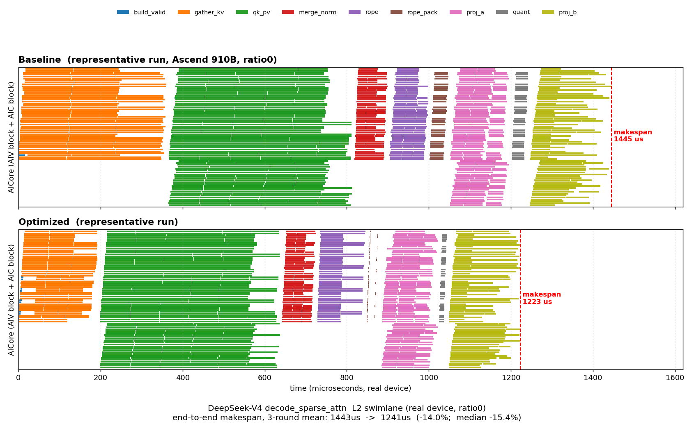

# `decode_sparse_attn` decode-kernel optimization

Real-device (Ascend 910B / `a2a3`) optimization of
`models/deepseek/v4/decode_sparse_attn.py`. All numbers below are measured on a
real NPU over 3 rounds; correctness (`ratio_allclose(atol=1e-4, rtol=1/128)`) is
preserved across every fixture and compression ratio.

## End-to-end result

| config | baseline | optimized | speedup |
|---|---:|---:|---:|
| **ratio0** (default; compressed slots mostly invalid) | 1443 µs | **1241 µs** | **−14.0%** (median −15.4%) |
| **ratio128** (compressed slots mostly invalid) | 1478 µs | **1331 µs** | **−9.9%** |
| ratio4 (compressed slots all valid) | 1818 µs | 1832 µs | +0.8% |

Total chip core-time (ratio0): 67154 µs → **57199 µs (−14.8%)**.

The swimlane (one row per AICore, bars colored by kernel) shows the per-stage
compression: `gather_kv` (orange) shrinks the most, and every downstream stage
starts and finishes earlier.

## What changed (7 optimizations, real-device per-kernel core-time, ratio0)

| kernel | change | core-time |
|---|---|---|
| `gather_kv` | **bulk-zero** the per-token packed-KV region in wide `[128,512]` tiles so invalid (`-1`) slots default to zero via a few wide MTE stores instead of one `[1,512]` dup-store each; valid rows copied under `pl.pipeline(stage=4)` | 14738 → **7545 µs (−48.8%)** |
| `rope_pack` | for a fixed `(group, head)` the rope segment is the same 64 columns for all `T` tokens, so write one strided `[T,64]` store per head instead of `T` separate `[1,64]` scatters | 1073 → **93 µs (−91.3%)** |
| `quant` | `QUANT_TILE 32 → 512`: clears two sub-512B MTE hints, raises Vec 1.7%→27% | 947 → **365 µs (−61.4%)** |
| `proj_b` | `B_K_TILE 128 → 256`: fills cube L0A/L0B (25%→50%), halves the K-loop (64→32) | 8359 → **7483 µs (−10.5%)** |
| `qk_pv` | reorder the loop nest (sparse-block outer / head-tile inner) and hoist the KV/bias slice so one KV L1 tile serves all 4 head-tiles instead of being reloaded per head (bit-identical) | 27932 → **27308 µs (−2.2%)** |
| `rope` | `rope_buf` FP32 → BF16 (the value is already BF16-rounded), halving its GM round-trip; `ROPE_TOKEN_TILE 1 → 2` | ~neutral (2MB→1MB GM) |
| `build_valid` | `pl.range` (1 serial task) → `pl.spmd` (8 parallel blocks) | critical-path ↓ |

`gather_kv` and `qk_pv` dominate the critical path, so `gather_kv`'s −48.8% is
what drives the end-to-end win.

## Methodology notes

- **Measured on real hardware.** The `a2a3sim` simulator reports host-emulation
  wall-clock (`std::chrono`), not device cycles, and is misleading for these
  structural changes (e.g. `proj_b` `B_K_TILE` reads as +15% on the sim but is
  −10.5% on device; `build_valid` parallelization reads as +551% on the sim but
  shortens the device critical path). Device latency comes from
  `dfx_outputs/l2_swimlane_records.json` (real device-cycle timing).
- **PMU-guided.** `--enable-pmu 2` confirmed each kernel's bottleneck pipe and
  guided the changes (e.g. `merge_norm` is mte3/store-bound, `proj_a_aic` is
  mte2/weight-bandwidth bound).

## Investigated and rejected

- **`merge_norm` nope-scatter batching** (same trick as `rope_pack`): it *did*
  fix the bottleneck (merge_norm −40% core-time, mte3 79%→15%), but unlike
  `rope_pack` (already a separate stage) `merge_norm` writes `o_packed` directly
  with the scatter hidden under its compute; splitting it into a separate
  `nope_pack` kernel **inserts a new critical-path stage** and regressed
  end-to-end by +2.2%. A store-bound kernel whose store is already
  pipeline-hidden should not be split out.
- **`ratio4` trade-off**: when all slots are valid the `gather_kv` bulk-zero is
  pure overhead (+0.8% end-to-end). Across the FLASH layer mix (mostly ratio4
  and ratio128) the ratio128 wins dominate. A pipeline-only variant (no bulk-zero)
  is neutral everywhere if an all-valid deployment prefers no ratio4 regression.
- **`proj_a` `stage 2→4`** and **`qk_pv` shared-KV-tile across both matmuls**
  were reverted (device-slower / SSA tile-orientation constraint).
